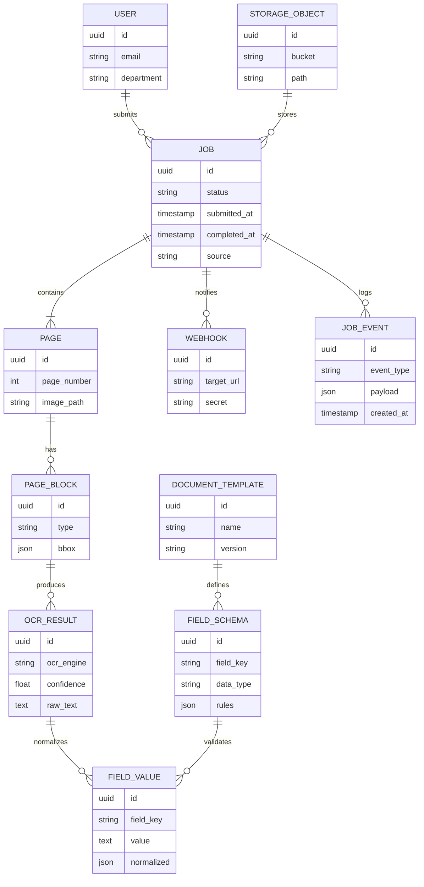

# ERD và lưu đồ xử lý PDF

## Mô hình thực thể (ERD)


## Lưu đồ xử lý PDF
```mermaid
flowchart TD
    A[Nhận file từ UI/API] --> B{Kiểm tra định dạng}
    B -->|PDF chuẩn| C[Đẩy vào S3/MinIO]
    B -->|Không hợp lệ| Z[Trả lỗi cho client]
    C --> D[Đăng ký job trong PostgreSQL]
    D --> E[Phát sự kiện lên hàng đợi Redis]
    E --> F[Worker lấy job]
    F --> G[Tiền xử lý ảnh (deskew, denoise)]
    G --> H{Loại tài liệu}
    H -->|Dễ/Trung bình| I[PaddleOCR Inference]
    H -->|Khó - cần GPU| J[PaddleOCR GPU Worker]
    H -->|Viết tay| K[Chuyển human-in-the-loop]
    I --> L[Trích xuất cấu trúc (bảng, form)]
    J --> L
    L --> M[Hậu xử lý (spell-check, chuẩn hóa)]
    M --> N[Mapping sang template]
    N --> O[Ghi kết quả OCR & field vào PostgreSQL]
    O --> P[Đẩy file kết quả (PDF + JSON) lên S3]
    P --> Q[Gửi webhook/thông báo]
    Q --> R[UI cập nhật trạng thái]
```
